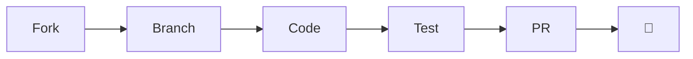

<div align="center">

```
╔╦╗╦ ╦╔═╗╦═╗╔╦╗╔═╗╦    ╔═╗╔═╗╔═╗╦ ╦╔╦╗
 ║ ╠═╣║╣ ╠╦╝║║║╠═╣║    ╚═╗║  ║ ║║ ║ ║ 
 ╩ ╩ ╩╚═╝╩╚═╩ ╩╩ ╩╩═╝  ╚═╝╚═╝╚═╝╚═╝ ╩ 
```

### 🔥 Find AI Models by Computational Temperature 🔥

[](https://opensource.org/licenses/MIT)
[](https://www.python.org/downloads/)
[](https://github.com/astral-sh/ruff)
[](https://github.com/astral-sh/uv)

[**Web Demo**](https://thermal-scout.circuitrylabs.com) • [**Documentation**](docs/) • [**API Reference**](docs/API.md) • [**Contributing**](CONTRIBUTING.md)

</div>

---

## ✨ What is Thermal Scout?

Thermal Scout helps you find AI models based on their **computational "thermal" cost** - a visual indicator of how much compute resources a model requires. Search through **1M+ models** on HuggingFace Hub with thermal awareness!

<div align="center">

| 🟢 **Cool** | 🟡 **Warm** | 🟠 **Moderate** | 🔴 **Hot** |
|:-----------:|:-----------:|:---------------:|:----------:|
| <1B params  | 1-3B params | 3-7B params     | 7B+ params |
| Edge devices| Workstations| ML rigs         | Data centers|

</div>

---

## 🚀 Quick Start

### 🌐 Web Interface

```bash
# Start local server
python -m http.server 8000

# Open in browser
open http://localhost:8000
```

### 💻 Command Line

```bash
# Install
uv pip install -e .

# Search models
thermal-scout search "llama" --limit 10
```

### 🔌 API Server

```bash
# Start API
uv run python run_api.py

# Interactive docs at http://localhost:8080/docs
```

---

## 📦 Installation

<details>
<summary><b>Prerequisites</b></summary>

- Python 3.12 or higher
- UV package manager (optional but recommended)
- Git

</details>

```bash
# Clone the repository
git clone https://github.com/circuitrylabs/thermal-scout.git
cd thermal-scout

# Install with uv (recommended)
uv pip install -e .

# Or with standard pip
pip install -e .
```

---

## 🎯 Features

<div align="center">

| Feature | Description |
|---------|-------------|
| 🔍 **Smart Search** | Search 1M+ models on HuggingFace Hub |
| 🌡️ **Thermal Indicators** | Visual computational cost at a glance |
| 🖥️ **Three Interfaces** | Web UI, CLI, and REST API |
| ⚡ **No API Key Required** | Direct HuggingFace Hub integration |
| 🚀 **Lightning Fast** | Minimal dependencies, cached results |
| 🎨 **Beautiful UI** | Clean, light-mode interface |

</div>

---

## 🛠️ Development

This project proudly uses the [**Astral**](https://astral.sh) toolchain:

<div align="center">

| Tool | Purpose | Command |
|------|---------|---------|
| ⚡ [**uv**](https://docs.astral.sh/uv/) | Fast package management | `uv sync` |
| 🎨 [**ruff**](https://docs.astral.sh/ruff/) | Lightning-fast linting | `uv run ruff check .` |
| 🔍 [**ty**](https://github.com/astral-sh/ty) | Blazing-fast type checker | `uv run ty` |

</div>

### Setup Development Environment

```bash
# Create virtual environment
uv venv

# Install all dependencies
uv sync --extra dev

# Run tests
uv run pytest

# Format code
uv run ruff format .
```

---

## 📁 Project Structure

```
thermal-scout/
│
├── 🌐 Frontend
│   ├── index.html         # Single-page web app
│   ├── app.js            # Frontend logic
│   └── styles.css        # Clean, minimal styling
│
├── 🐍 Backend
│   └── thermal_scout/    # Python package
│       ├── cli.py       # Typer CLI interface
│       ├── search.py    # Core search logic
│       └── api/         # FastAPI endpoints
│
├── 🧪 Testing
│   └── tests/           # Comprehensive test suite
│
└── 📚 Documentation
    └── docs/           # User & API docs
```

---

## 🤝 Contributing

We love contributions! Check out our [**Contributing Guide**](CONTRIBUTING.md) to get started.

<div align="center">



</div>

---

## 📄 License

MIT License - see [LICENSE](LICENSE) file for details.

---

## 🔗 Links

<div align="center">

[**Documentation**](docs/) • [**Issues**](https://github.com/circuitrylabs/thermal-scout/issues) • [**Discussions**](https://github.com/circuitrylabs/thermal-scout/discussions)

[**CircuitryLabs**](https://circuitrylabs.com) • [**HuggingFace**](https://huggingface.co)

</div>

---

<div align="center">

Made with ❤️ by [**CircuitryLabs**](https://circuitrylabs.com)

*Choose models that match your computational resources!* 🔥

</div>